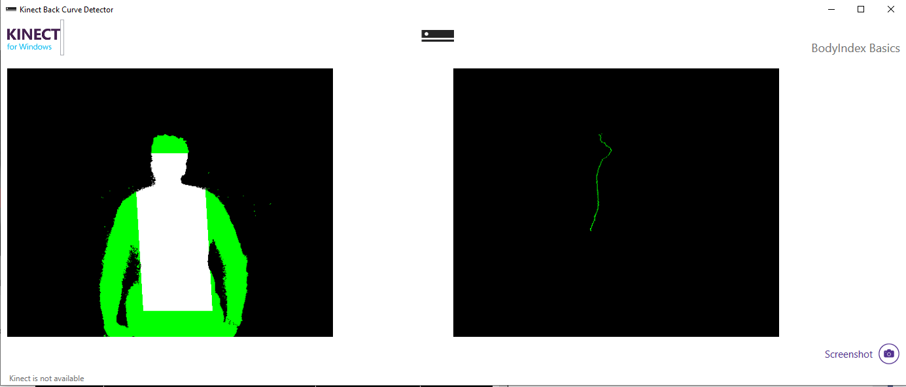
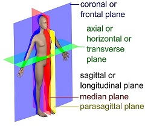
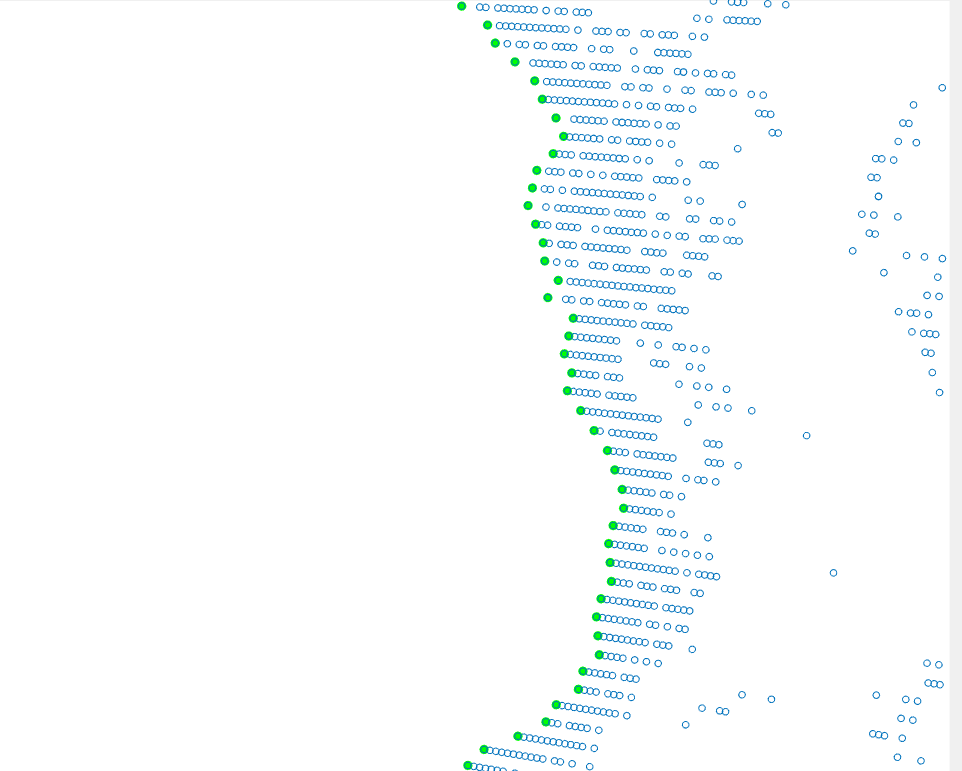
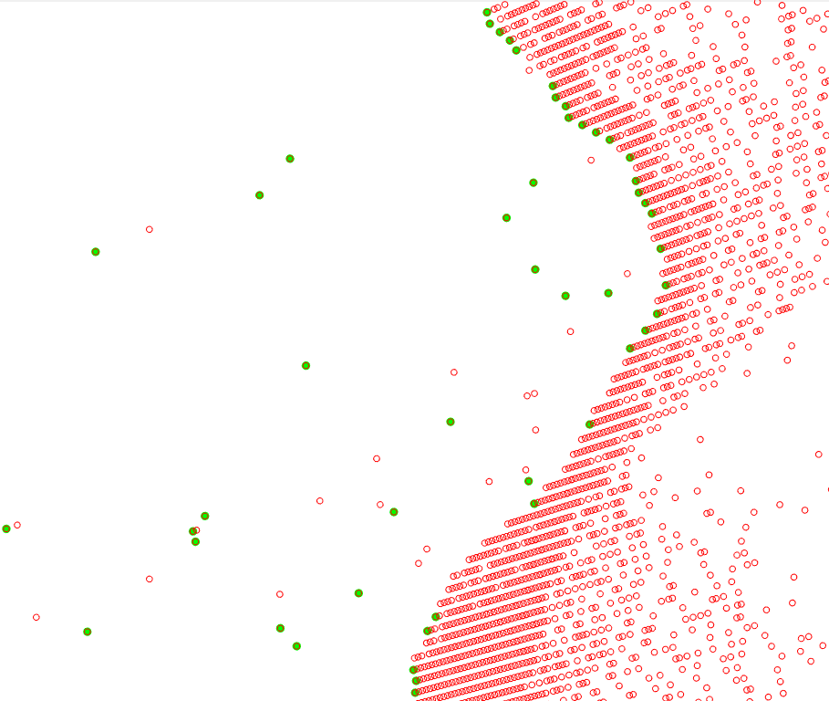
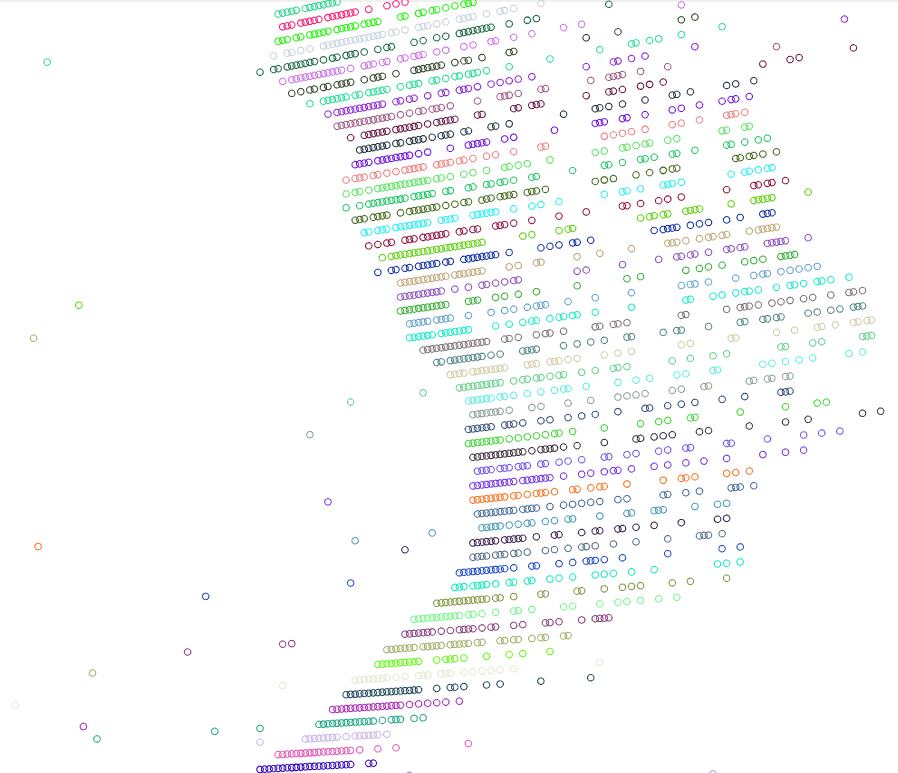
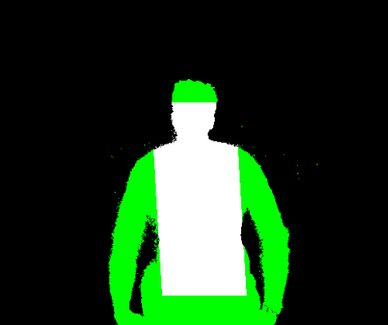

# Kinect Back Curve Detector 
## Overview 

The application uses body and depth data from Kinect V 2.0 to create an outline of person's back in outline.

In order for the application to work correctly, a person has to sit with their back oriented towards a Kinect, the frontal plane has to be approximately parallel to the Kinect camera plane.




## Algorithm overview



At first, all 2D points of the body (acquired using Kinect body index data source) are converted to 3D points using Kinect coordinate mapper. After that these 3D points are projected to the median plane of the body, thus getting the view of the back from the side.

Now, in order to find the outline of the back one needs to pick the extreme points from the projected points.

Extreme points:


(*green - extreme points, blue - projected points*)

However, the data acquired from Kinect contains noise. The strategy of picking extreme points doesn't work on such data, because one may choose noisy point as a back point that spoils the outline quite drastically.

Noisy data:



(*green - extreme points on noisy data*)

Hence at first the data needs to be filtered. The problem of detecting noisy points in point clouds (we consider the projected points as a point cloud) is quite time consuming. The common approach of solving such a problem is k-nearest neighbors. The main idea is that the k nearest point to each point of a point cloud, then calculate some metrics with regards to them (usually the metrics is related to the sum of distances (not necessary euclidean distances) from the point to its neighbors. Then the threshold is set and all points with the metrics greater than the threshold are considered noisy.

This approach works fine, however, has one crucial disadvantage - it really slow for our purposes. Even with KD-tree that is considered to be one of the fastest way of finding neighbors, the computing time for one frame way around 330 - 600 ms (depending on a value of k and the number of points that vary from frame to frame). This means that only 1.5 - 3 frames will be proceed per second, while Kinect is sending us 30 frames. 

Thus, another algorithm needs to be used. Luckily, the data obtained from Kinect isn't just a random point cloud. It turned out that it is possible to change our problem. So, instead of finding noisy points in the whole point cloud, it is split in rows, then the noisy points are found in each row. Rows are chosen based on rows of pixels in the depth frame, so each row of pixels is converted to 3D row of points, then we use k-nearest neighbors to determine the noisy points (now it is easy to find nearest points - after the row is sorted, previous k / 2 and next k / 2 neighbors are actually these k nearest neighbors). It turned out that performance of this simple algorithm is very good - 21 - 28 ms in debug mode and 9 - 11 ms in Release mode (run without debugger attached, CPU - i7-4790, 16 Gb of DDR3 memory and integrated video card). This means that all frames from Kinect are processed and there is this time to do something with the back data.

Rows visualisation, each row is in different color:



Also to even further speed up the process we may project not all points of the body, but rather only the points of the back. As Kinect provides us with skeleton data, we can check if the point is inside the back really easy. At first, from Kinect data the neck, left and right shoulders,hip, spine points are found. After that we make a line through spine points. Then the lines perpendicular to the spine line are drawn through the hip and neck, parallel to the spine line - through left and right shoulder. The space confined by these lines is considered to be back area. After that we check for each point if it's inside the area, if so - project it to the median plane. 

Back area (shown in white):



Note that Kinect sometimes do not recognize hip point correctly (it is too high), when the person is sited, so maybe in future another approach should be used.

## Back data processing

Right now the back data received from Kinect is not processed, it's just shown on the screen.

if you want to actually process data, you need to do it in the following function:

```MainWindow.xaml.cs```:
``` csharp
private void MultisorceReader_FrameArrived(object sender, MultiSourceFrameArrivedEventArgs e)
{
    ...

    // calculate and show the back position on the screen
    var spinePoints = GetSpinePoints(body, depthBuffer, bodyIndexBuffer);
    
    // Process the spinePoints here

    drawSpinePoints(spinePoints);
    RenderBodyIndexPixels();

    ...
}
```
```spinePoints``` is the ```List``` of ```Point```, where the first coordinate of point stores depth, the second - height relative to Kinect sensor. The List is sorted by height, meaning that the first point has the maximum height, the last one - minimum.

## Raw data processing

Sometimes is useful to process data acquired from Kinect with another application to better understand some patterns and test your ideas *(see [this project](https://github.com/vitaliy1919/Back-Curvature-From-File) to see an example of a project that process and visualize data from Kinect).* 

In order to turn writing to file on you have to change the value of a constant `debugData` to `true`:
```MainWindow.xaml.cs```:
``` csharp
    public partial class MainWindow : Window, INotifyPropertyChanged
    {

        private const bool debugData = true;
```

After that the file `write.txt` will be generated.

The content of the file:
```
############## FRAME START ##############
1.215, 0.2373521
1.207, 0.2357958
-100, -100
1.237, 0.2383046
1.219, 0.2348433
1.203, 0.2317669
1.195, 0.2302315
************** FRAME END **************
```

Inside there is a description of each frame - starting with `############## FRAME START ##############` and ending with `************** FRAME END **************`. Between these lines there will be the information about the projected points - each line contains the depth and height of the point. Each row of points is separated by a special line - `-100 -100`